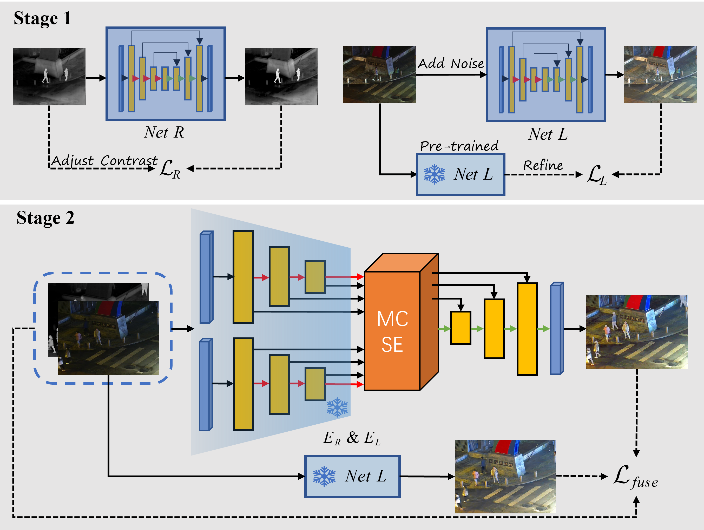

# VCIF: Visually Compelling Infrared and Visible Image Fusion under Darkness

:star: If you've found VCIF useful for your research or projects, please show your support by starring this repo. Thanks! :hugs:

---
>Infrared and visible image fusion (IVF) enables comprehensive representation of low-light scenes. Current IVF
methods are prone to yield visually poor results in extremely dark conditions because they tend to focus solely on
the fusion process without considering the degradation of source images. To solve this problem, a novel infrared
and visible image fusion method is proposed, which incorporates low-light image enhancement (LLIE) within a
unified framework to achieve visually compelling fusion results even under severe environments, namely VCIF.
The network first acquires proficient capabilities in illumination correction and chromatic transformation over
LLIE tasks. Then, the LLIE module of VCIF is refined for varying brightness conditions through image enhancement and denoising. Finally, the fusion step is realized through elaborate fusion rules and a simple encoder
decoder structure based on Transformer blocks. Moreover, a maximum selection loss that integrates intensity
and gradient constrained on different color spaces is designed to boost the fusion performance. Experimental
results exhibit that the proposed method outperforms the state-of-the-art methods by generating human-aligned
visual results.
>
---

## Update
- **2025.08.25**: VCIF is released.


## Requirements
```
conda create -n vcif python=3.10
conda activate vcif
pip install torch==2.4.0 torchvision==0.19.0 torchaudio==2.4.0 --index-url https://download.pytorch.org/whl/cu121
cd vcif
pip install -r requirements.txt
python setup.py develop
```
## Inference
Download the weight from this [link](https://pan.baidu.com/s/1TmG2QJaDM3492jhmJNYmdQ?pwd=884b) and put it in the folder of "checkpoints".
```
python ./inference/inference_VCIF.py
```


## Training
### 1. Prepare your dataset
LLIE tasks: [LOL](https://github.com/weichen582/RetinexNet)

IVF tasks: [MSRS](https://github.com/Linfeng-Tang/PIAFusion) , [LLVIP](https://github.com/bupt-ai-cz/LLVIP) , [M3FD](https://github.com/JinyuanLiu-CV/TarDAL)

Download the datasets above and place them in the "datasets" folder, or use the enhanced datasets from this [link](https://pan.baidu.com/s/1QVsXMOqvFV3J3elDjxNoyw?pwd=2yci), organized as follows:

For LLIE training:
```bash
    dataset/
        train/
            LLIE/
                lq_patches/ #low images
                gt_patches/ #ground truth
```
For IVF training:
```bash
    dataset/
        train/
            IVF/
                ir_patches/ #ir images
                vi_patches/ #vi images
                en_patches/ #pseudo ground truth
```
For LLIE testing:
```bash
    dataset/
        eval/
          LLIE/
            gt/ #ground truth
            lq/ #low images
```
For IVF testing:
```bash
    dataset/
        IVF/ 
            infrared/ #vislbe images
            visible/ #vislbe images
```
### (Optional) 2. Stage 1 training and prepare pseudo GT
The purpose of this step is to obtain pre-trained net L and net R, as well as enhanced pseudo GT. You can also directly use our weights to skip this step.

Train the network using the following command:
```
python ./basicsr/train.py '-opt' './options/train/train_backbone_for_LLIE.yml'
```
Switch the network to be trained by changing the "source" parameter, training folders, "pretrain_network_g" and "yonly" (true for L, false for R) in the config file.
 
Once you have the trained net L, use the following command to generate the pseudo GT:
```
python ./generate_gt.py
```
### 3. Stage 2 training
```
python ./basicsr/train.py '-opt' './options/train/train_VCIF_for_LLIE.yml'
```

## Acknowledgement
This project is based on [BasicSR](https://github.com/XPixelGroup/BasicSR). Thanks for their awesome works.

## Contact
If you have any questions, please feel free to contact me via "244603040@csu.edu.cn" or open an issue.
## References
If you find this repository useful for your research, please cite the following work.
```
@article{LI2025114227,
title = {VCIF: Visually-compelling infrared and visible image fusion under darkness},
journal = {Knowledge-Based Systems},
volume = {328},
pages = {114227},
year = {2025},
issn = {0950-7051},
doi = {https://doi.org/10.1016/j.knosys.2025.114227},
author = {Chenggong Li and Junchao Zhang and Degui Yang and Dangjun Zhao}
}
```
